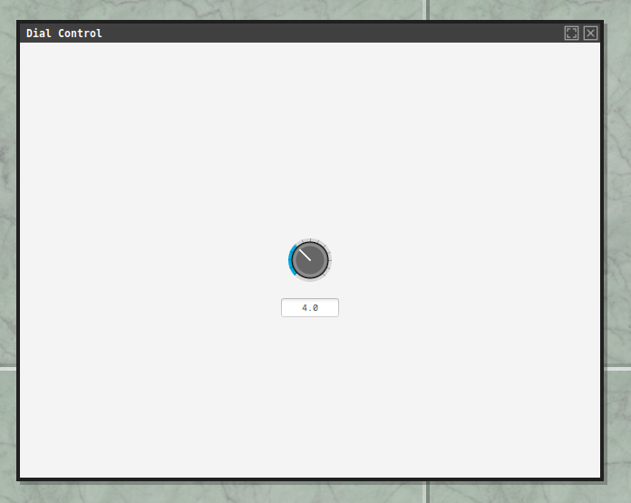
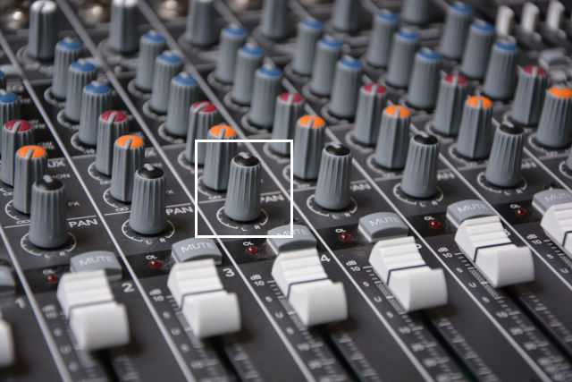
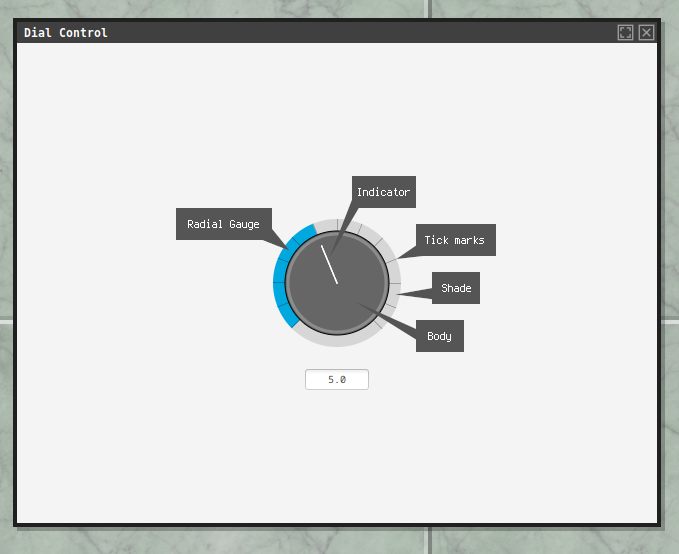
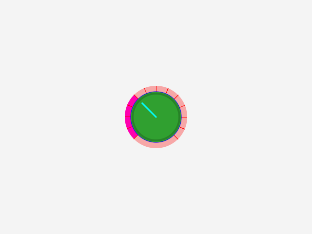

digal
===

[](http://search.maven.org/#search%7Cga%7C1%7Cg%3A%22com.io7m.digal%22)
[](https://s01.oss.sonatype.org/content/repositories/snapshots/com/io7m/digal/)
[](https://codecov.io/gh/io7m/digal)


| JVM | Platform | Status |
|-----|----------|--------|
| OpenJDK (Temurin) Current | Linux | [](https://github.com/io7m/digal/actions?query=workflow%3Amain.linux.temurin.current)|
| OpenJDK (Temurin) LTS | Linux | [](https://github.com/io7m/digal/actions?query=workflow%3Amain.linux.temurin.lts)|
| OpenJDK (Temurin) Current | Windows | [](https://github.com/io7m/digal/actions?query=workflow%3Amain.windows.temurin.current)|
| OpenJDK (Temurin) LTS | Windows | [](https://github.com/io7m/digal/actions?query=workflow%3Amain.windows.temurin.lts)|

## Digal

A customizable, scalable JavaFX rotary dial.



### Features

* CSS-styleable rotary dials
* Scalable to any size
* [OSGi](http://www.osgi.org)-ready
* [JPMS](https://en.wikipedia.org/wiki/Java_Platform_Module_System)-ready
* High coverage automated test suite
* ISC license

### Maven

```
<dependency>
  <groupId>com.io7m.digal</groupId>
  <artifactId>com.io7m.digal.core</artifactId>
  <version>${latest}</version>
</dependency>
```

### What Is A Dial?

A dial is a rotary knob seen on hardware such as guitar amplifiers, mixing
desks, and etc.



In `digal`, a dial carries a real value in the range `[0, 1]` where `0` means "
turned fully anti-clockwise" and `1` means "turned fully clockwise". Each dial
can be provided with a value converter that converts this internal value to
something else for display purposes.

Dials are constrained to a `270°` range in order to unambiguously indicate the
current value at a glance.

Visually, a dial consists of the following components:



* An _indicator_ is a small notch on the dial that shows which direction the
  dial is pointing.
* A _radial gauge_ is a filled in arc segment showing how far away the current
  dial setting is from the minimum.
* The _tick marks_ are small marks around the dial that can be used to indicate
  discrete values. The number of tick marks can be customized.
* The _shade_ emulates the way dials are often recessed into hardware. The shade
  can be disabled.
* The _body_ is the actual physical dial.

The text field below the dial is _not_ part of the dial itself, and is a plain
text field bound the dial value for demonstration purposes.

Dials are manipulated by clicking the body and dragging upwards and downwards
on the Y axis. Dragging upwards turns the dial clockwise, and dragging downwards
turns the dial anti-clockwise.

### Value Converters

As mentioned, dials use real values in the range `[0,1]`. A dial instance
can be provided with a _value converter_ that allows for converting internal
values to something else for use externally. The package comes with a number
of built-in converters, but implementing a converter only involves implementing
a simple two-method interface. For example, a converter that allows a dial
to have discrete values in the range `[0, 12]` could be specified as follows:

```
dial0.setValueConverter(
  new DialValueConverterType()
  {
    @Override
    public double convertToDial(
      final double x)
    {
      return x / 12.0;
    }

    @Override
    public double convertFromDial(
      final double x)
    {
      return (double) Math.round(x * 12.0);
    }
  });
```

Note that it would probably also be a good idea to set the number of tick
marks to `12`:

```
dial0.setTickCount(12);
```

### CSS

The dial components can be customized to some extent with CSS. Assuming
a dial with id `#dial0`, the following CSS will produce an ugly looking dial:

```
#dial0
{
  dial-body-color: #30a030;
  dial-body-stroke-color: #0000ff;
  dial-emboss-color: #00000030;
  dial-emboss-size: 4.0;
  dial-indicator-color: #00ffff;
  dial-indicator-size: 3.0;
  dial-radial-gauge-color: #ff00ff;
  dial-radial-gauge-size: 6.0;
  dial-shade-color: #ff000050;
  dial-tick-color: #ff0000;
  dial-tick-size: 1.0;
}
```



